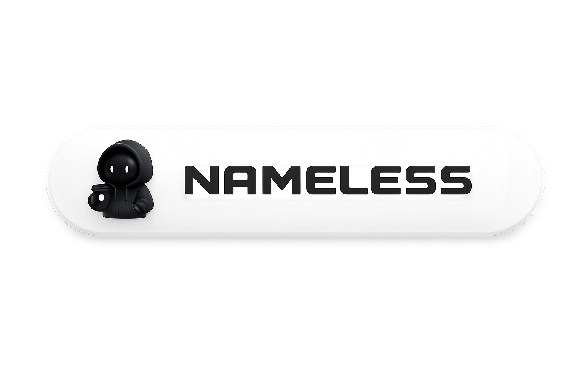
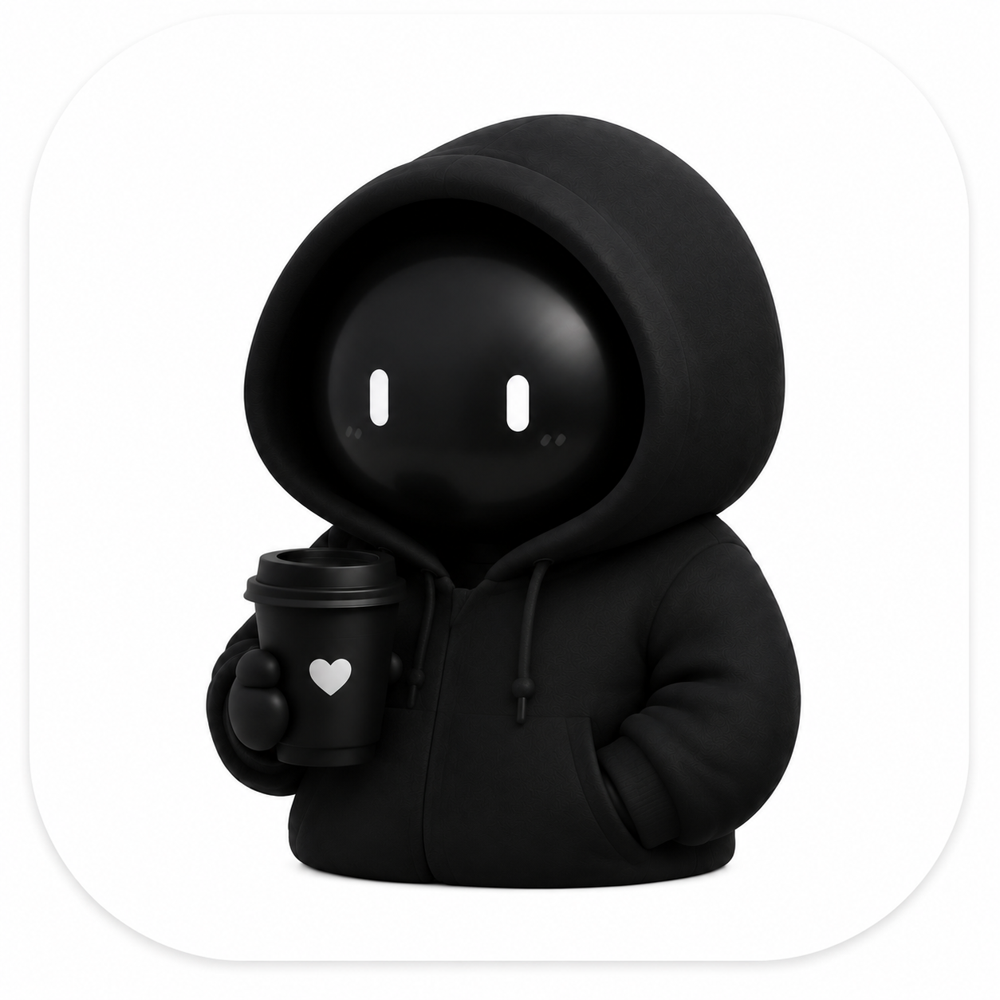

# nameless

  

  <b>nameless - кастомный iOS-клиент Telegram с фирменным брендингом, Liquid Glass-оформлением и отдельным центром настроек.</b>

  
  
  
  

  

## О проекте

`nameless` - неофициальный iOS-клиент на базе Telegram с собственным визуальным стилем, фирменной иконкой, круглым интерфейсом, Liquid Glass-поверхностями и отдельным экраном nameless-настроек.

Названия `nameless`, логотип, badge, скриншоты и авторские визуальные материалы используются как часть бренда проекта. Telegram, upstream-код и сторонние библиотеки сохраняют свои исходные лицензии.

## Что уже работает

- Вкладка `nameless` в настройках с фирменной иконкой.
- Поиск по nameless-настройкам.
- Разделы `Внешний вид`, `Режим призрака`, `О nameless`, `Функции nameless`, `Жидкое стекло`.
- Скрытые legacy-вкладки nameless Pro, открываемые долгим нажатием.
- Ссылки `Канал nameless`, `Разработчик glswee`, `Stiven VPN`, открывающиеся внутри клиента.
- Liquid Glass-переключатели для сообщений, профиля, настроек, inline-кнопок и других поверхностей.
- Видео-фон для чата с выбором, заменой и удалением.
- Круглые icon-only кнопки профиля.
- Профильный блок nameless с иконкой перед ником для официального аккаунта.
- Мгновенный откат nameless-настроек.

## Функции nameless

Ниже перечислены реальные функции проекта. Если возле функции стоит `*`, значит она ещё в разработке, является заглушкой или требует дополнительной интеграции.

### Центр nameless

- `Поиск настроек` - ищет все доступные nameless-пункты и открывает нужный экран.
- `Внешний вид` - настройки интерфейса, карточек, фонов, профиля и музыки.
- `Режим призрака` - набор приватных переключателей для скрытия статусов и действий.
- `О nameless` - информационный экран с официальными ссылками проекта.
- `Функции nameless` - общий каталог подключённых nameless-возможностей.
- `Жидкое стекло` - управление Liquid Glass-поверхностями по отдельным зонам.
- `Мгновенный откат настроек` - возвращает nameless-настройки к состоянию на момент открытия экрана.

### Сообщения

- `Сохранять удалённые сообщения` - сохраняет удалённые сообщения локально.
- `Сохранять медиа удалённых сообщений` - оставляет фото, видео и файлы.
- `Сохранять реакции удалённых сообщений` - хранит реакции в локальной базе.
- `Сохранять удалённые сообщения для ботов` - отдельная логика для диалогов с ботами.
- `Сохранять историю редактирования` - хранит предыдущие версии сообщений.
- `Локальное редактирование сообщений` - позволяет править сообщения локально на устройстве.
- `Сохранять самоуничтожающиеся сообщения` - сохраняет исчезающие сообщения, если это доступно клиентской логикой.
- `Сохранять самоуничтожающиеся медиа` - сохраняет исчезающие вложения локально.
- `Скрыть детекцию скриншотов` - убирает реакцию клиента на событие скриншота там, где это возможно.
- `Убрать blur секретных чатов` - отключает размытие при просмотре secret chat.
- `Показывать удалённые сообщения` - отображает уже сохранённые удалённые сообщения.
- `Оригинал отредактированных` - показывает исходный вариант сообщения до редактирования.
- `Сокращать сообщения` - компактнее отображает длинные сообщения.
- `Счётчик символов при вводе` - показывает длину текста во время набора.
- `Счётчик символов в сообщениях` - показывает длину уже отправленного сообщения.

### Режим призрака

- `Скрыть онлайн-статус` - прячет присутствие.
- `Скрыть статус набора` - скрывает typing-индикатор.
- `Скрыть статус записи голосового` - скрывает запись voice.
- `Скрыть статус загрузки файлов` - скрывает upload-индикатор.
- `Скрыть прочтение сообщений` - отключает read receipts.
- `Скрыть просмотр сторис` - отключает отметку просмотра stories.
- `Читать при действиях` - делает действия в чате менее заметными.
- `Отложенная отправка (12 сек)` - задерживает отправку сообщений.
- `Устройство` - подменяет или фиксирует device-поведение в приватных сценариях.
- `Подмена геолокации` - подставляет выбранные координаты.
- `Всегда онлайн` - держит аккаунт в клиентской логике как online.
- `Скрыть статус набора текста` - дополнительный фильтр для typing.
- `Скрыть просмотр истории онлайна` - скрывает действия, связанные с историей присутствия.

### Безопасность и приватность

- `Скрыть номер телефона` - убирает номер из профиля там, где это поддерживается.
- `Показывать ID и DC в профиле` - добавляет служебные данные в профиль.
- `Показывать приблизительную дату` - показывает более грубую дату вместо точной.
- `Защита от мошенников` - добавляет дополнительные предупреждения и проверки.
- `Предупреждать перед звонком` - показывает предупреждение перед call-действием.
- `Обход защищённого контента` - открывает защищённые элементы, если клиентская часть это позволяет.

### Внешний вид

- `Полные числа вместо сокращения` - показывает `1400` вместо `1.4K`.
- `Убрать Zalgo` - очищает искажённый текст.
- `Локальный баланс звёзд` - показывает локально заданное значение Stars.
- `Панель форматирования над клавиатурой` - держит formatting panel видимой.
- `Кнопка "Перевести" всегда видима` - не прячет кнопку перевода.
- `Круглые кнопки в профиле` - делает profile actions icon-only и круглыми.
- `Стиль карточки музыки` - переключает вид музыкального блока.
- `Видео на фоне чата` - ставит зацикленное фоновое видео без звука.
- `Обои профиля` - отдельный фон или обложка профиля.
- `Блюр аватара в профиле` - добавляет blur на аватар.
- `Блюр обложки в плеере` - добавляет blur на cover в плеере.
- `Эффект в плеере` - включает дополнительное визуальное оформление плеера.
- `Цвет бейджа острова` - настраивает цвет badge-элемента.
- `Обводка сообщений` - добавляет контур сообщениям.
- `Прозрачные сообщения` - делает сообщения прозрачнее.
- `Полупрозрачные сообщения` - делает сообщения полупрозрачными.
- `Размытие сообщений` - применяет blur к bubble-поверхностям.
- `Широкие посты в каналах` - расширяет отображение постов.
- `Эффект частиц` - включает декоративный эффект частиц.
- `Папки снизу` - переносит папки в нижнюю часть интерфейса.
- `Надпись "Чаты" в списке чатов` - управляет заголовком списка.
- `Премиум-статус в шапке` - показывает premium badge в header.
- `Скрыть кнопку поиска` - убирает иконку поиска.
- `Неограниченное закрепление чатов` - снимает лимит на pinned chats.
- `Новый вид переключателя аккаунтов` - меняет account switcher на floating card.
- `Скрыть кнопку записи голосовых` - убирает кнопку voice record.
- `Скрыть кнопку "Избранное" в меню` - прячет лишний пункт из меню.
- `Скрыть нижний таббар` - отключает нижнюю навигацию там, где это уместно.
- `Высота панели` - меняет размер панели вкладок.
- `Ширина панели` - меняет ширину панели вкладок.
- `Включить пользовательский шрифт` - подставляет выбранный шрифт проекта.
- `Использовать наш логотип везде` - заменяет Telegram-иконки на nameless-ассеты.

### Функции nameless *

Следующие пункты отображаются в интерфейсе или запланированы, но требуют дополнительной доводки:

- `Смена голоса *` - экран есть, но полный pipeline ещё не завершён.
- `nameless AI *` - AI-блок под дальнейшую интеграцию.
- `Модель Gemini *` - маршрут для AI-сценария.
- `Панель плагинов *` - требует дальнейшей работы над менеджером плагинов.
- `Отключить рекламу в каналах *` - зависит от конкретной реализации канала.

## Статус реализации

- Брендинг и видимые строки переведены на `nameless`.
- Новый экран nameless уже подключён в навигацию.
- Liquid Glass включается по отдельным зонам через настройки.
- Видео-фон и rollback настроек подключены в текущем коде.
- Ряд старых пунктов nameless Pro спрятан за long-press.

## Официальные ссылки

- Канал: [t.me/hanmeta](https://t.me/hanmeta)
- Разработчик: [t.me/kreadwrite](https://t.me/kreadwrite)
- Stiven VPN: [t.me/stivenvpnbot](https://t.me/stivenvpnbot)

## Права

Copyright (c) 2026 nameless.

Запрещено копировать, продавать, переименовывать, перепаковывать или выдавать за свой проект бренд `nameless`, логотипы, badge, дизайн, скриншоты и проектные материалы без письменного разрешения владельца.

Telegram, upstream iOS-код и сторонние библиотеки принадлежат своим правообладателям и используются по их лицензиям. `nameless` не является официальным продуктом Telegram.
